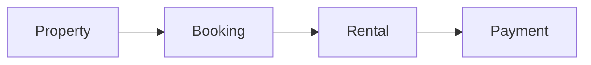

# Property Rental Management System (Backend)

A robust, production-ready RESTful API designed to manage the full lifecycle of property rentals. From multi-role authentication to structured financial tracking, this system provides a scalable foundation for apartments, hotels, and event spaces.

---

## System Overview

The system operates on a linear progression model, ensuring data integrity from the moment a property is listed to the final payment of a lease.

### The Core Flow



1. **Discovery:** Users browse and filter verified property listings.
2. **Request:** A Tenant submits a **Booking Request** for specific dates.
3. **Validation:** The Property Manager reviews and either **Approves** or **Rejects** the request.
4. **Activation:** Upon approval, the system automatically generates an **Active Rental** (Lease).
5. **Financials:** Tenants make **Payments** (deposits, recurring rent, or full stays) against the Rental.
6. **Closure:** The Rental record tracks the stay until completion or termination.

---

## Role-Based Access Control (RBAC)

The system features a dynamic role-switching model (similar to Fiverr) allowing users to pivot between tenant and manager flows.

| Role                 | Responsibilities                                                                                           |
| -------------------- | ---------------------------------------------------------------------------------------------------------- |
| **Admin**            | System-wide moderation, manager application approval, category management, and global financial oversight. |
| **Property Manager** | Managing property listings, media uploads, and approving/rejecting booking requests.                       |
| **User (Tenant)**    | Browsing properties, managing personal booking requests, and processing rental payments.                   |

---

## Tech Stack

- **Runtime:** Node.js (ES Modules)
- **Framework:** Express.js
- **Database:** PostgreSQL
- **ORM:** Prisma
- **Documentation:** Swagger UI (OpenAPI)

---

# API Reference

All endpoints are prefixed with `/api/v1`. Detailed interactive documentation is available at `{BASE_URL}/api/doc`.

# Authentication (`/auth`)

| Method | Endpoint    | Description                                        |
| ------ | ----------- | -------------------------------------------------- |
| `POST` | `/register` | Create a new tenant account                        |
| `POST` | `/login`    | Authenticate and receive JWT Access/Refresh tokens |

# Admin Operations (`/admin`)

| Method  | Endpoint                | Description                              |
| ------- | ----------------------- | ---------------------------------------- |
| `GET`   | `/manager-applications` | Review pending manager requests          |
| `PATCH` | `/property/:id/approve` | Verify and publish a property listing    |
| `GET`   | `/payments/summary`     | Global financial reporting and analytics |

# Property Manager Operations (`/property-manager`)

| Method  | Endpoint                | Description                                   |
| ------- | ----------------------- | --------------------------------------------- |
| `POST`  | `/properties`           | List a new property (requires Admin approval) |
| `PATCH` | `/bookings/:id/approve` | Transition a booking into an active rental    |

# Tenant Operations (`/user`)

| Method | Endpoint                | Description                                                 |
| ------ | ----------------------- | ----------------------------------------------------------- |
| `GET`  | `/properties`           | Browse listings with advanced filtering (city, date, price) |
| `POST` | `/bookings`             | Submit a reservation request                                |
| `POST` | `/rentals/:id/payments` | Submit rent, deposits, or partial payments                  |

---

# Database Architecture

The system utilizes a fully normalized PostgreSQL schema to ensure transaction safety and data consistency.

**Key Entities:**

- **Users & Roles:** Handles authentication and RBAC.
- **Properties:** Includes metadata, categories, and image associations.
- **Bookings:** Stores the "intent" to rent including requested duration.
- **Rentals:** The legal contract bridging a user to a property.
- **Payments:** Detailed ledger for every financial transaction tied to a rental.

---

# Getting Started

1. **Clone & Install**

```bash
git clone https://github.com/One-Marvellous/Property-Rental-Management-System.git
cd property-rental-management-system
npm install

```

2. **Environment Setup**
   Create a `.env` file and configure your `DATABASE_URL` and `JWT_SECRET`.
3. **Database Migration**

```bash
npx prisma db pull
npx prisma generate

```

4. **Launch**

```bash
npm run dev

```
